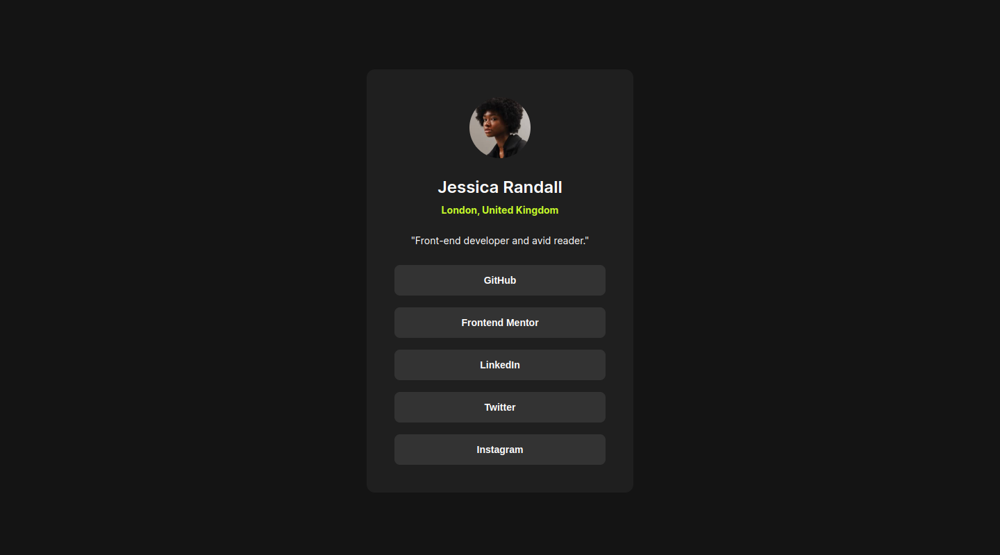

# Frontend Mentor - Social links profile solution

This is a solution to the [Social links profile challenge on Frontend Mentor](https://www.frontendmentor.io/challenges/social-links-profile-UG32l9m6dQ).

## Overview

### The challenge

Users should be able to:

- See hover and focus states for all interactive elements on the page

### Screenshot

### Links

- Solution URL: [https://github.com/wpkasun/Social-links-profile](https://github.com/wpkasun/Social-links-profile)
- Live Site URL: [https://wpkasun.github.io/Social-links-profile/](https://wpkasun.github.io/Social-links-profile/)

## My process

### Built with

- Semantic HTML5 markup
- CSS custom properties
- Flexbox
- Mobile-first workflow

## Author

- Frontend Mentor - [@wpkasun](https://www.frontendmentor.io/profile/wpkasun)
- LinkedIn - [@wpkasun](https://www.linkedin.com/in/wpkasun/)
- GitHub - [@wpkasun](https://github.com/wpkasun)
